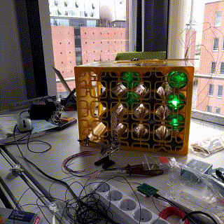

MateMatrix - Driver Software for a Club Mate based LED Matrix Display
=====================================================================

This is the driver software for the iteratec Mate Matrix. It is designed to run on an Ardunio (or compatible) board connected to a [MAX7219 DS](http://playground.arduino.cc/Main/MAX72XXHardware) LED Matrix driver.
This Project is a Freiday Project initiated for the [HackerSchool](http://hacker-school.de/) event in April 2017.

## Building and Running the Software

You can open up the matematrix.ino file in your Arduino IDE. After that you can flash it onto an Arduino Chip connected via USB.

