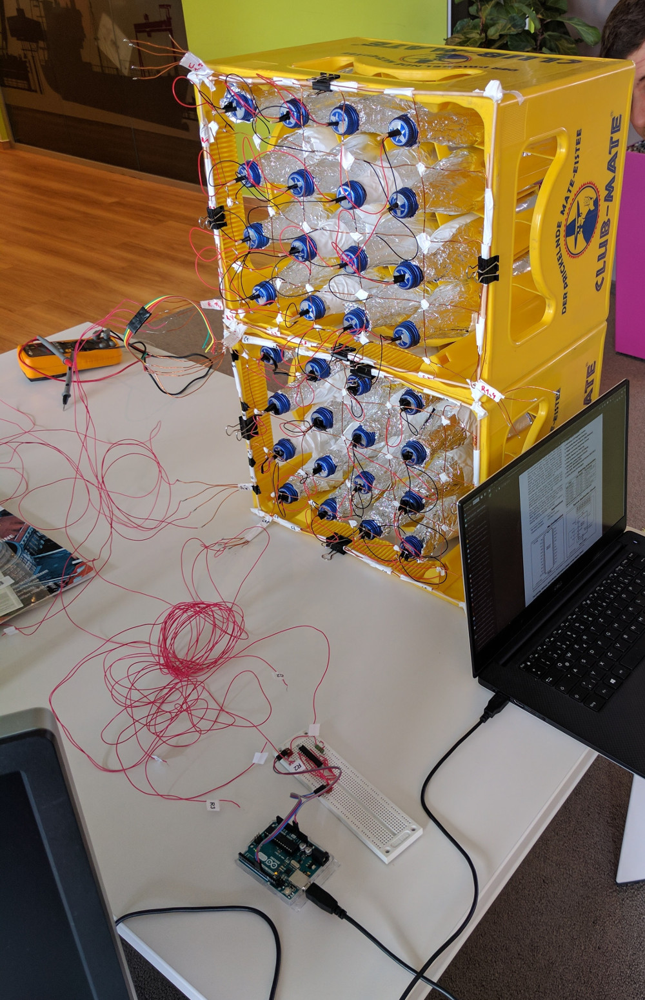

MateMatrix - Driver Software for a Club Mate based LED Matrix Display
=====================================================================

This is the driver software for the iteratec Mate Matrix. It is designed to run on an Ardunio (or compatible) board connected to a [MAX7219 DS](http://playground.arduino.cc/Main/MAX72XXHardware) LED Matrix driver.
This Project is a Freiday Project initiated for the [HackerSchool](http://hacker-school.de/) event in April 2017.

## Building and Running the Software

You can open up the matematrix.ino file in your Arduino IDE. After that you can flash it onto an Arduino Chip connected via USB.

### Build and Upload using make

If you prefer not to use the Arduino IDE you can build the software using [make](https://de.wikipedia.org/wiki/Make). You have to install the [Arduino-Makefile](https://github.com/sudar/Arduino-Makefile) support.

    sudo apt-get install arduino-mk

After that you will be able to build the software with

    make

In order to flash the software onto the arduino chip you have to issue

    make upload

Note that you might have to adapt some of the make variables based on your system:

    ARDUINO_DIR – Directory where Arduino is installed
    ARDMK_DIR – Directory where you have copied the makefile (you may not need this)
    AVR_TOOLS_DIR – Directory where avr tools are installed (you may not need this)
	ARDUINO_PORT – The port or device where the microcontroller is connected

## Library internals

We use the LedControl Library and provide a facade for it. The library is available via [Github](https://github.com/wayoda/LedControl). Documentation can be found on [the libraries Adruino Playgroud page](http://playground.arduino.cc/Main/LedControl)

